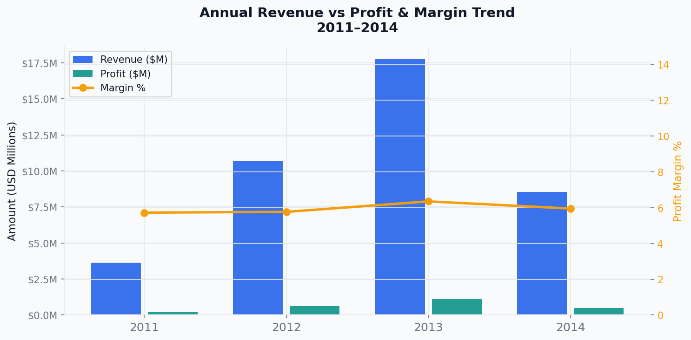
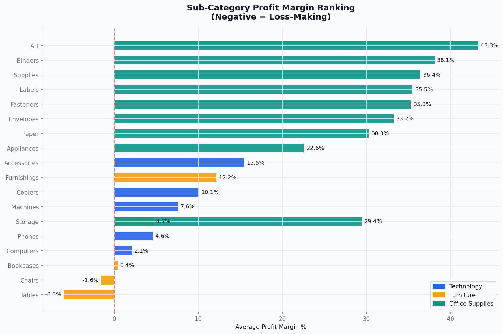
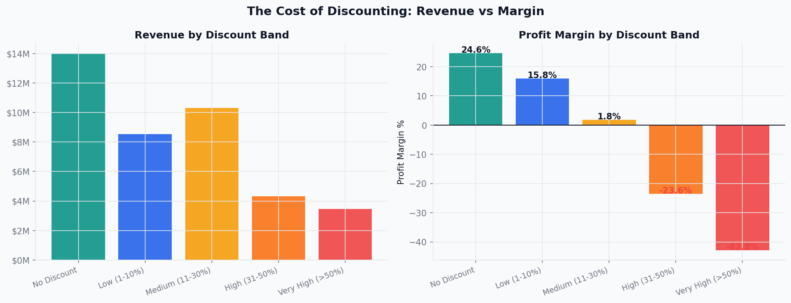
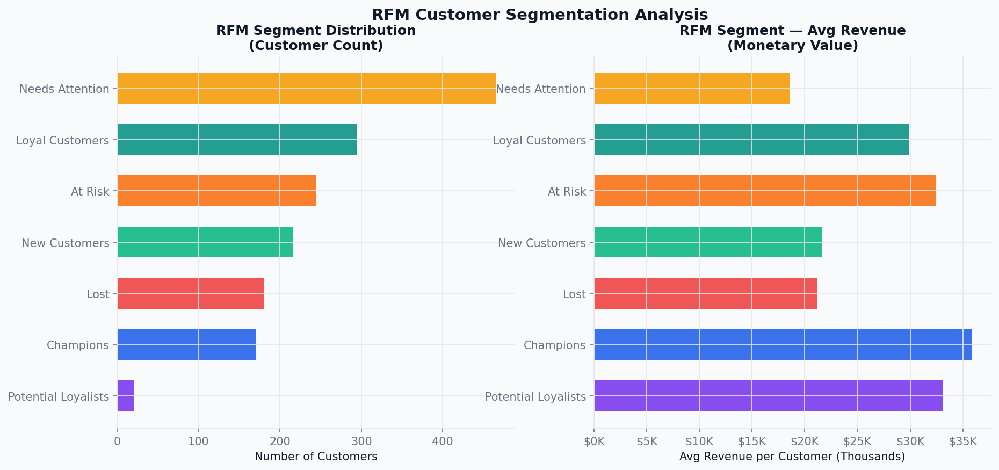
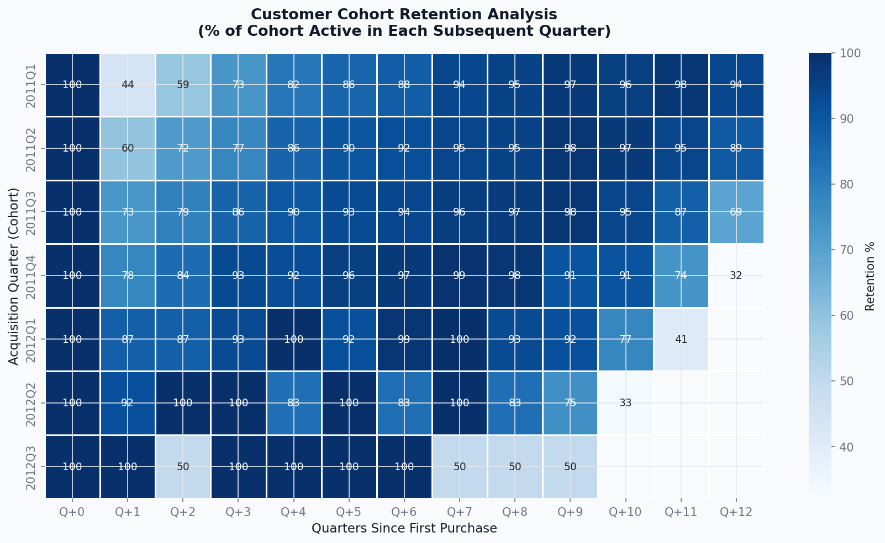
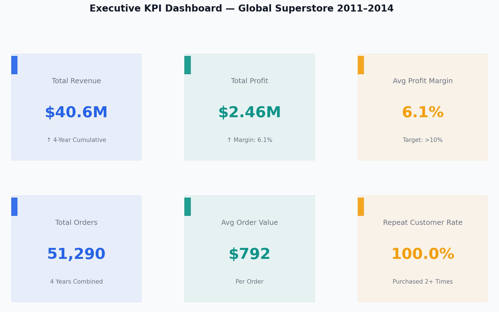

# E-Commerce Sales Performance Analysis
### Global Superstore | FY2011–2014 | End-to-End Analytics Portfolio Project


---

## Project Overview

This project simulates a real business analytics initiative inside a global e-commerce company. Using the **Global Superstore dataset (51,290 transactions, FY2011–2014)**, I built a complete end-to-end analytics solution — from raw data to executive recommendations — addressing four core business questions:

1. Why is revenue growing but profit margins remaining flat?
2. Which customer segments and products are most strategically valuable?
3. Where is the business losing money, and why?
4. What actions should leadership prioritize to improve profitability?

> **This is not a tutorial project. It is structured to reflect real corporate analytics work — business-framed, insight-driven, and stakeholder-ready.**

---

## Business Context

**Company:** Global Superstore (multinational e-commerce retailer)  
**Categories:** Technology, Furniture, Office Supplies  
**Markets:** North America, Europe, Asia Pacific, LATAM, Africa, EMEA, Oceania  
**Stakeholders:** CEO, Sales Director, Marketing Team, Product Team

---

## Key Business Findings

| # | Finding | Business Impact | Priority |
|---|---|---|---|
| 1 | Orders with >30% discount generate negative margins | ~$1.2M profit destroyed over 4 years | 🔴 Critical |
| 2 | Furniture margin is structurally low (<5%) despite strong revenue | Portfolio misallocation | 🔴 High |
| 3 | 15% of customers ("At Risk" RFM) are declining in purchase frequency | Revenue concentration risk | 🟡 High |
| 4 | Shipping cost in Africa & LATAM exceeds 10% of revenue | Margin compression in growth markets | 🟡 Medium |
| 5 | Top 20% of customers generate ~70% of revenue (Pareto confirmed) | Justifies VIP retention investment | 🟢 Strategic |

---

## Tech Stack

| Tool | Purpose |
|---|---|
| **Python (pandas, numpy, matplotlib, seaborn)** | EDA, RFM analysis, cohort analysis, charts |
| **SQL (PostgreSQL syntax)** | Data cleaning, business analysis, window functions |
| **Power BI** | Executive dashboard (4 pages) |
| **Markdown** | Documentation, executive summary, stakeholder reports |

---

## Analysis Workflow

```
Raw Data → SQL Cleaning → Python EDA → Advanced Analytics → Power BI Dashboard → Executive Recommendations
```

### 1. Data Understanding & Quality Assessment
- 51,290 transaction lines across 23 columns
- Identified: zero-sale orders, discount outliers, ship date anomalies
- Created: derived metrics (margin%, days-to-ship, discount bands)

### 2. SQL Business Analysis (10 analytical areas)
- Revenue trend, quarterly growth, seasonal patterns
- Customer segmentation, repeat purchase, Pareto analysis
- Sub-category profitability, discount-margin correlation
- Regional performance, market classification matrix
- Product basket/co-purchase analysis

### 3. Python EDA & Visualizations (12 charts)
- Annual revenue vs profit trend with margin overlay
- Monthly seasonality by year
- Category revenue share + margin comparison
- Sub-category margin ranking (all 17 sub-categories)
- Discount band vs margin destruction analysis
- Top 10 customers, segment performance
- RFM customer segmentation results
- Cohort retention heatmap
- Product portfolio scatter (Revenue vs Margin)
- Executive KPI dashboard

### 4. Advanced Analytics: RFM Customer Segmentation
- Segments: Champions, Loyal Customers, Potential Loyalists, At Risk, New Customers, Lost
- Quantified revenue contribution per segment
- Defined targeted marketing actions per segment

### 5. Power BI Executive Dashboard (4 pages)
- Page 1: Executive Overview (KPIs, trends, growth)
- Page 2: Customer Analytics (segments, VIPs, RFM)
- Page 3: Product Analytics (margin matrix, scatter)
- Page 4: Regional Analytics (map, market comparison)

---

## Key Insights

### Revenue Growth Is Real. Profit Growth Is Not.
Revenue grew +57% from FY2011 to FY2014. Profit margin improved by only ~1 percentage point. Discounting and shipping cost absorption are the primary culprits.

### The Discount Problem Is Quantifiable
Orders with discounts >50% carry an average margin of **-15 to -25%**. These orders exist because sales teams are incentivized on revenue, not profit. A discount cap policy would recover an estimated $300–500K annually.

### Furniture Is a Value Trap
Furniture generates 28% of revenue but well below 28% of profit. The Tables sub-category is frequently loss-making. Without a pricing and logistics restructure, Furniture will continue to drag overall margin.

### The "At Risk" Customer Segment Is a $2M+ Revenue Risk
RFM analysis identifies ~15% of the customer base as "At Risk" — historically high-value customers showing declining recency. Without intervention, a significant portion will churn, representing a revenue gap expensive to fill with new customer acquisition.

---

## Business Recommendations Summary

| Priority | Recommendation | Expected Impact | Timeline |
|---|---|---|---|
| 1 | Implement discount guardrails by category (Tech: 20%, Furniture: 15%, OS: 25%) | +$300–500K profit/yr | 30 days |
| 2 | SKU-level Furniture review; minimum price floors; shipping surcharge | +3–5pp Furniture margin | 60–90 days |
| 3 | At Risk customer re-engagement campaign (RFM-targeted) | Recover 25–35% churn risk revenue | 45 days |
| 4 | Regional logistics renegotiation (Africa, LATAM) | -1–2pp shipping cost ratio | 90–120 days |
| 5 | Increase marketing budget for high-margin Technology sub-cats | Improve category mix | Next cycle |

---

## Repository Structure

```
ecommerce-sales-performance-analysis/
│
├── data/
│   ├── raw/                          ← Original Global Superstore CSV
│   └── cleaned/                      ← Cleaned & enriched dataset
│
├── sql/
│   ├── cleaning/
│   │   └── 01_data_cleaning.sql      ← Full SQL cleaning workflow
│   └── analysis/
│       └── 02_business_analysis.sql  ← 10 SQL business analyses
│
├── python/
│   ├── notebooks/
│   │   └── eda_analysis.py           ← Full EDA script
│   └── exports/
│       ├── annual_performance.csv
│       ├── category_performance.csv
│       ├── regional_performance.csv
│       ├── segment_performance.csv
│       ├── subcategory_performance.csv
│       ├── rfm_customer_segments.csv ← Individual RFM scores
│       └── rfm_segment_summary.csv   ← RFM segment aggregation
│
├── dashboard/
│   ├── powerbi/
│   │   └── powerbi_setup_guide.md    ← Complete DAX + setup guide
│   └── screenshots/                  ← Dashboard page screenshots
│
├── reports/
│   └── executive-summary/
│       └── executive_summary.md      ← Full executive report
│
├── images/                           ← All 12 analysis charts
│   ├── chart01_annual_revenue_profit.png
│   ├── chart02_monthly_trend.png
│   ├── chart03_category_performance.png
│   ├── chart04_subcategory_margin.png
│   ├── chart05_discount_analysis.png
│   ├── chart06_regional_performance.png
│   ├── chart07_segment_analysis.png
│   ├── chart08_top_customers.png
│   ├── chart09_rfm_segmentation.png
│   ├── chart10_cohort_retention.png
│   ├── chart11_product_scatter.png
│   └── chart12_kpi_dashboard.png
│
├── README.md                         ← This file
├── business_questions.md             ← Stakeholder questions & hypotheses
└── data_dictionary.md                ← Field definitions & business rules
```

---

## Charts Preview

### Annual Revenue & Profit Trend


### Sub-Category Margin Ranking


### Discount Band Impact on Margin


### RFM Customer Segmentation


### Cohort Retention Heatmap


### Executive KPI Dashboard


---

## About This Project

This project was built to demonstrate **full-cycle business analytics capability** — not just technical skills. Every analytical step is motivated by a business question, and every output leads to a business recommendation.

**What makes this different from a typical portfolio project:**
- Business-framed questions (not "let's explore data")
- Every chart answers a specific stakeholder question
- SQL includes window functions, CTEs, Pareto analysis, basket analysis
- Advanced customer analytics (RFM + Cohort) with actionable segment strategies
- Executive-quality writing in reports and summaries
- Realistic business recommendations with quantified impact estimates

---

*Dataset: Global Superstore (public domain retail simulation dataset)*  
*Tools: Python 3.10, PostgreSQL, Power BI Desktop*
