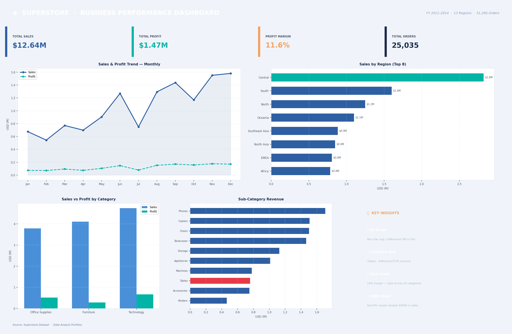

# 📊 Superstore Business Performance Dashboard



## 🔍 Project Overview

An end-to-end **Excel Sales Dashboard** built from the Superstore dataset, designed to answer real business questions using data visualization and analyst thinking — not just pivot tables.

> **Target role:** Data Analyst  
> **Tools used:** Microsoft Excel, Python (pandas, openpyxl, matplotlib)  
> **Dataset:** Superstore Global Sales (51,290 orders · FY 2011–2014)

---

## 📁 Repository Structure

```
superstore-dashboard/
│
├── dashboard.xlsx              # Main Excel dashboard (5 sheets)
├── dashboard.png               # Dashboard preview screenshot
├── README.md                   # This file
│
├── data/
│   └── sales_data.xlsx         # Cleaned source dataset
│
└── images/
    └── dashboard_preview.png   # High-res dashboard image
```

---

## 🎯 Business Questions Answered

| Question | Finding |
|---|---|
| Where does revenue come from? | Central region leads at $2.8M (22% of total) |
| Which products sell a lot but profit little? | Furniture — $4.1M sales, only 6.9% margin |
| Which sub-category is loss-making? | Tables: −$64K profit on $757K revenue |
| What is the seasonal trend? | Q4 (Nov–Dec) averages $1.6M/month — 3× February |
| Which category drives profitability? | Technology leads with 14% margin and $664K profit |

---

## 📊 Dashboard Structure

### Sheet 1 — Dashboard
- **KPI Cards**: Total Sales ($12.64M) · Total Profit ($1.47M) · Margin (11.6%) · Orders (25,035)
- **Line Chart**: Monthly Sales & Profit trend (12 months)
- **Bar Chart**: Top 10 Regions by Sales
- **Grouped Bar**: Sales vs Profit by Category
- **Horizontal Bar**: Sub-Category Revenue Breakdown

### Sheet 2 — Insights
Five analyst-grade findings with root cause + recommended action for each.

### Sheet 3 — Summary
Executive summary table with regional performance breakdown and status flags.

### Sheet 4 — Data
Pivot-ready aggregation tables (monthly, regional, category, sub-category, yearly).

### Sheet 5 — Raw Data
5,000-row sample of the cleaned dataset for reference and validation.

---

## 💡 Key Insights

### 📈 Q4 Seasonal Surge
November and December consistently hit **~$1.6M/month** — more than **3× the February low** ($0.5M). Q3 prep is critical for capturing this demand spike.

### ⚠️ Furniture Margin Alert
Despite being the **2nd largest revenue category** ($4.1M), Furniture margins sit at just **6.9%** — far below Technology's 14%. The **Tables sub-category is outright loss-making**: −$64K profit on $757K in sales.

### 🏆 Technology is the Growth Engine
Technology leads in both **Sales ($4.7M)** and **Profit ($664K)**. Phones and Copiers alone drive **$3.2M** in revenue. This is the category to double down on.

### 🌍 Regional Concentration + Underperformers
**Central region** = 22% of total revenue, creating concentration risk. **EMEA** ($806K sales, <6% margin) and **Southeast Asia** ($884K sales, 2% margin) are consistently underperforming — likely due to discount misuse or shipping cost inefficiency.

### 🎯 Segment Opportunity
Consumer dominates volume (~$6.5M) but **Corporate segment** may offer better margin at scale. B2B targeting with volume-based incentives could shift the mix.

---

## 🛠️ How to Use

1. **Download** `dashboard.xlsx`
2. **Open** in Microsoft Excel (2016 or later recommended)
3. Navigate using the sheet tabs at the bottom
4. Charts and summary tables are fully pre-built — no setup required

---

## 📦 Dataset

- **Source**: [Superstore Dataset — Kaggle](https://www.kaggle.com/datasets/vivek468/superstore-dataset-final)
- **Size**: 51,290 rows · 27 columns
- **Period**: January 2011 – December 2014
- **Scope**: Global sales across North America, Europe, Asia-Pacific, Africa

---

## 👤 About

Built as part of a **Data Analyst portfolio** to demonstrate:
- Business thinking beyond raw data
- Professional Excel dashboard design
- Insight extraction and actionable recommendations
- Clean project documentation

---

*If this project was helpful, please ⭐ star the repo!*
