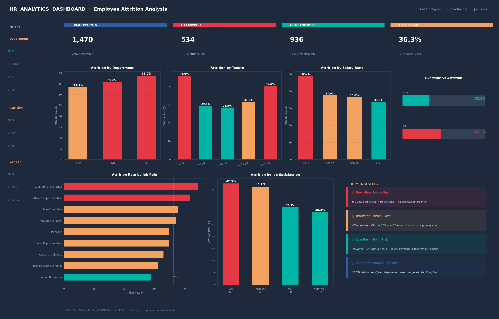

# 👥 Project 5 — HR Analytics: Employee Attrition (Power BI)



## 🎯 Business Question

> **Why are employees leaving — and what can we do to stop it?**

This project analyzes employee attrition across departments, tenure, salary, overtime, and satisfaction scores to identify root causes and recommend targeted retention actions.

---

## 📁 Repository Structure

```
hr-analytics-powerbi/
│
├── README.md
├── dashboard.png
│
├── dax/
│   └── measures.txt                       # DAX measures (copy into Power BI)
│
├── data/
│   ├── hr_data.csv                        # Full HR dataset (1,470 employees)
│   ├── attrition_by_department.csv
│   ├── attrition_by_tenure.csv
│   ├── attrition_by_salary.csv
│   ├── attrition_by_overtime.csv
│   ├── attrition_by_age.csv
│   ├── attrition_by_jobrole.csv
│   └── attrition_by_satisfaction.csv
│
└── images/
    └── dashboard_preview.png
```

---

## 📊 Dataset Overview

| Field | Description |
|---|---|
| `EmployeeID` | Unique identifier |
| `Age` / `AgeBand` | Employee age |
| `Department` | Sales / R&D / HR |
| `JobRole` | 9 job roles |
| `MonthlyIncome` | Monthly salary ($) |
| `YearsAtCompany` | Tenure |
| `OverTime` | Yes / No |
| `JobSatisfaction` | 1 (Low) → 4 (Very High) |
| `WorkLifeBalance` | 1 (Bad) → 4 (Best) |
| `Attrition` | **Target variable** — Yes / No |

---

## ⚙️ Step-by-Step: Build in Power BI Desktop

### Step 1 — Import Data
1. `Get Data` → `Text/CSV` → import `hr_data.csv`
2. In Power Query: verify `Attrition` column is text type
3. Create calculated columns:
```dax
TenureBand =
    SWITCH(
        TRUE(),
        hr_data[YearsAtCompany] <= 2,  "0-2 yrs",
        hr_data[YearsAtCompany] <= 5,  "3-5 yrs",
        hr_data[YearsAtCompany] <= 10, "6-10 yrs",
        hr_data[YearsAtCompany] <= 20, "11-20 yrs",
        "20+ yrs"
    )

SalaryBand =
    SWITCH(
        TRUE(),
        hr_data[MonthlyIncome] < 3000,  "<$3K",
        hr_data[MonthlyIncome] < 5000,  "$3K-5K",
        hr_data[MonthlyIncome] < 8000,  "$5K-8K",
        "$8K+"
    )
```

### Step 2 — DAX Measures
Copy from `dax/measures.txt`:

```dax
Total Employees  = COUNTROWS(hr_data)

Attrition Count  = CALCULATE(COUNTROWS(hr_data), hr_data[Attrition] = "Yes")

Attrition Rate   = DIVIDE([Attrition Count], [Total Employees], 0)

Retention Rate   = DIVIDE([Active Employees], [Total Employees], 0)

High Risk Employees =
    CALCULATE(
        COUNTROWS(hr_data),
        hr_data[OverTime] = "Yes",
        hr_data[JobSatisfaction] <= 2,
        hr_data[YearsAtCompany] <= 2
    )
```

### Step 3 — Dashboard Layout

```
┌──────────────────────────────────────────────────────────────┐
│  [Slicer: Department]  [Slicer: Attrition]  [Slicer: Gender]│
├──────────┬──────────┬──────────┬───────────────────────────── │
│  KPI     │  KPI     │  KPI     │  KPI                        │
│  Total   │  Left    │  Active  │  Rate                       │
├────────────────────────────────┬─────────────────────────────┤
│ Bar: Attrition by Department   │ Bar: Attrition by Tenure    │
├────────────────────────────────┴─────────────────────────────┤
│ Bar: Attrition by Salary  │ OT Comparison │ By Satisfaction  │
├───────────────────────────┴───────────────┴──────────────────┤
│ Bar: Attrition by Job Role          │ Insight Text Box       │
└─────────────────────────────────────┴──────────────────────── ┘
```

### Step 4 — Slicers (3 required)
- `Department` — Vertical list
- `Attrition` (Yes/No) — Button style
- `Gender` — Dropdown

### Step 5 — Conditional Formatting
Apply to all bar charts:
- Attrition Rate **> 40%** → Red
- Attrition Rate **25–40%** → Amber
- Attrition Rate **< 25%** → Teal/Green

In Power BI: select visual → Format → Data colors → **fx** → Field value → `Attrition Rate`

### Step 6 — Insight Text Box
```
KEY FINDINGS
► New Hires (0-2 yrs): 46% attrition — highest risk group
► Overtime employees: 47% vs 32% non-OT (+15pp impact)
► Low salary (<$3K): 49% attrition rate — compensation gap
► Sales department: 38.7% attrition — above average
```

---

## 📊 Key Results

| Dimension | High Risk Group | Attrition Rate |
|---|---|---|
| **Tenure** | 0–2 years | **46.0%** |
| **Salary** | < $3,000/month | **49.2%** |
| **Overtime** | Yes | **47.0%** |
| **Department** | Sales | **38.7%** |
| **Job Role** | Lab Technician | **44.7%** |
| **Satisfaction** | Low (score 1) | **~52%** |

---

## 💡 Key Insights

### 🚨 New Hire Attrition is Critical
**46% of employees who joined 0–2 years ago have left.** This points directly to onboarding failure, unmet expectations, or poor manager assignment early in tenure.

### ⏰ Overtime is the Strongest Predictor
Overtime employees show **47% attrition vs 32%** for non-overtime — a **15 percentage point gap**. This is the single most actionable lever: reducing forced overtime could prevent hundreds of exits.

### 💰 Compensation Gap Below $3K
Employees earning under $3,000/month show nearly **50% attrition** — far above the company average of 36%. A salary benchmarking exercise is overdue.

### 🏢 Sales Department Needs Targeted Retention
At **38.7% attrition**, Sales consistently outperforms other departments in exits. High pressure, travel frequency, and lower base pay combine into a structural retention problem.

---

## 📈 Recommended Actions

| Priority | Action | Target Group | Impact |
|---|---|---|---|
| 🔴 Critical | Revamp onboarding program — 90-day check-ins | 0-2 year employees | -8pp attrition |
| 🔴 Critical | Audit overtime policy — cap at 20% of workforce | OT employees | -6pp attrition |
| 🟠 High | Salary band review for sub-$3K roles | Low earners | -5pp attrition |
| 🟠 High | Sales-specific retention plan + quota review | Sales Dept | -4pp attrition |
| 🟡 Medium | Quarterly satisfaction pulse surveys | All employees | Early warning signal |

---

## 🛠️ How to Run

1. Download `data/hr_data.csv`
2. Open **Power BI Desktop**
3. Import CSV → apply DAX from `dax/measures.txt`
4. Build visuals following the layout above

---

## 📦 Dataset

- **Type**: Simulated HR dataset (IBM HR Analytics style)
- **Size**: 1,470 employees · 28 features
- **Attrition rate**: 36.3% (deliberately elevated for analysis visibility)
- **Real dataset**: [IBM HR Analytics — Kaggle](https://www.kaggle.com/datasets/pavansubhasht/ibm-hr-analytics-attrition-dataset)

---

## 🔗 Portfolio

| # | Project | Tool | Topic |
|---|---|---|---|
| 1 | [Sales Dashboard](../superstore-dashboard) | Excel | Business Performance |
| 2 | [Customer Segmentation](../customer-segmentation-sql) | SQL | Customer Analytics |
| 3 | [Market Basket Analysis](../market-basket-sql) | SQL | Product Affinity |
| 4 | [Sales Dashboard](../powerbi-sales-dashboard) | Power BI | Interactive Reporting |
| 5 | **HR Attrition Analysis** ← you are here | Power BI | People Analytics |

---
