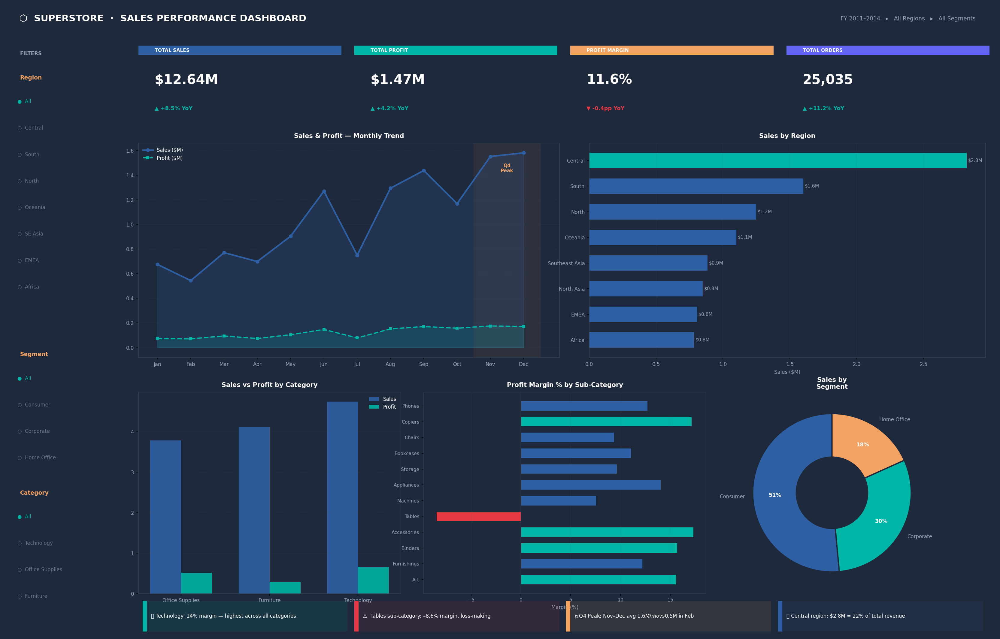

# 📊 Project 4 — Sales Performance Dashboard (Power BI)



## 🎯 Business Question

> **What is the overall business performance — and where are the opportunities and risks?**

A Power BI dashboard replicating the visual analysis from Project 1, rebuilt with DAX measures, slicers, and interactive drill-through for a fully dynamic reporting experience.

---

## 📁 Repository Structure

```
powerbi-sales-dashboard/
│
├── README.md
├── dashboard.png                    # Dashboard screenshot
│
├── dax/
│   └── measures.dax                 # All DAX measures (copy into Power BI)
│
├── data/
│   ├── monthly.csv                  # Monthly aggregation
│   ├── region.csv                   # Region aggregation
│   ├── category.csv                 # Category aggregation
│   └── segment.csv                  # Segment aggregation
│
└── images/
    └── dashboard_preview.png
```

---

## ⚙️ Step-by-Step: Build This in Power BI Desktop

### Step 1 — Import Data
1. Open **Power BI Desktop** → `Get Data` → `Text/CSV`
2. Import `superstore.csv` (or connect directly to Excel)
3. In **Power Query Editor**:
   - Set `Order Date` column type → **Date**
   - Rename columns: remove dots/spaces (e.g. `Order.Date` → `Order Date`)
   - Click **Close & Apply**

### Step 2 — Create a Date Table (Required for Time Intelligence)
Go to **Modeling** tab → `New Table`:
```dax
Date = CALENDAR(DATE(2011,1,1), DATE(2014,12,31))
```
Then add columns:
```dax
Year        = YEAR('Date'[Date])
Month       = MONTH('Date'[Date])
Month Name  = FORMAT('Date'[Date], "MMM")
Quarter     = "Q" & QUARTER('Date'[Date])
```
Link `Date[Date]` → `orders[Order Date]` in **Model view**.

### Step 3 — Create DAX Measures
In the **Data** pane, right-click your table → `New Measure`. Add all measures from `dax/measures.dax`:

```dax
Total Sales    = SUM(orders[Sales])

Total Profit   = SUM(orders[Profit])

Profit Margin  = DIVIDE([Total Profit], [Total Sales], 0)

Total Orders   = DISTINCTCOUNT(orders[Order ID])

Sales YoY %    = DIVIDE(
                    [Total Sales] - CALCULATE([Total Sales], SAMEPERIODLASTYEAR('Date'[Date])),
                    CALCULATE([Total Sales], SAMEPERIODLASTYEAR('Date'[Date])),
                    0
                 )
```

### Step 4 — Dashboard Layout

Build in this order (top → bottom, left → right):

```
┌─────────────────────────────────────────────────────────┐
│  [Slicer: Region]  [Slicer: Segment]  [Slicer: Category]│
├──────────┬──────────┬──────────┬──────────────────────── │
│  KPI     │  KPI     │  KPI     │  KPI                   │
│  Sales   │  Profit  │  Margin  │  Orders                │
├──────────────────────────┬──────────────────────────────┤
│  Line Chart              │  Bar Chart                   │
│  Sales by Month          │  Sales by Region             │
├────────────┬─────────────┴──────────────────────────────┤
│  Bar Chart │  Bar Chart              │  Donut Chart     │
│  Category  │  Sub-Category Margin    │  Segment Share   │
├────────────┴─────────────────────────┴──────────────────┤
│  [Insight Text Box: 4 key findings]                     │
└─────────────────────────────────────────────────────────┘
```

### Step 5 — Format for Impact (Ăn điểm)

| Element | Setting |
|---|---|
| KPI Cards | Card visual · bold value · small label · accent top border |
| Sales Margin | Format as `0.0%` — NOT raw decimal |
| Sales/Profit | Format as `$#,##0` |
| Axis labels | `$0M`, `$1M`, `$2M` format |
| Theme | Dark mode (`View → Theme → Executive`) or custom dark hex |
| Conditional formatting | Red for negative margin sub-categories |

### Step 6 — Add Slicers
Insert 3 slicers (vertical list style):
- `orders[Region]`
- `orders[Segment]`  
- `orders[Category]`

Set **Format → Slicer header** on, **Selection → Single select** off (allow multi-select).

### Step 7 — Insight Text Box
Insert a **Text Box** at the bottom:
```
KEY INSIGHTS
▸ Technology leads: 14% profit margin — highest category
▸ Tables sub-category: –8.6% margin (loss-making, review pricing)
▸ Q4 surge: Nov–Dec average $1.6M/month vs $0.5M in February
▸ Central region: $2.8M revenue (22% of total)
```

---

## 📊 DAX Measures Summary

| Measure | Formula | Purpose |
|---|---|---|
| `Total Sales` | `SUM(Sales)` | Core KPI |
| `Total Profit` | `SUM(Profit)` | Core KPI |
| `Profit Margin` | `DIVIDE([Profit],[Sales])` | Margin % |
| `Total Orders` | `DISTINCTCOUNT(Order ID)` | Volume KPI |
| `Sales LY` | `CALCULATE(..., SAMEPERIODLASTYEAR)` | YoY comparison |
| `Sales YoY %` | `DIVIDE([Sales]-[Sales LY],[Sales LY])` | Growth rate |
| `Margin Color` | `SWITCH(TRUE(), ...)` | Conditional color |

---

## 💡 Key Insights

### 🏆 Technology Drives Profitability
$4.7M in sales with **14% margin** — nearly double the Furniture margin. Phones & Copiers are the anchor sub-categories.

### ⚠️ Tables Sub-Category: Immediate Review
**–8.6% margin** on $757K revenue. The only consistently loss-making sub-category. Discount policy or pricing needs restructuring.

### 📈 Q4 Seasonal Peak
November–December average **$1.6M/month** — plan inventory and campaigns in Q3 to maximize this window.

### 🌍 Central Region Concentration
Central = **22% of revenue ($2.8M)**. EMEA and Southeast Asia underperform at <6% margin despite decent order volume.

---

## 📦 Dataset

- **Source**: [Superstore Dataset — Kaggle](https://www.kaggle.com/datasets/vivek468/superstore-dataset-final)
- **Rows**: 51,290 · **Period**: FY 2011–2014

---

## 🔗 Portfolio

| # | Project | Tool | Topic |
|---|---|---|---|
| 1 | [Sales Dashboard](../superstore-dashboard) | Excel | Business Performance |
| 2 | [Customer Segmentation](../customer-segmentation-sql) | SQL | Customer Analytics |
| 3 | [Market Basket Analysis](../market-basket-sql) | SQL | Product Affinity |
| 4 | **Sales Dashboard** ← you are here | Power BI | Interactive Reporting |

---
