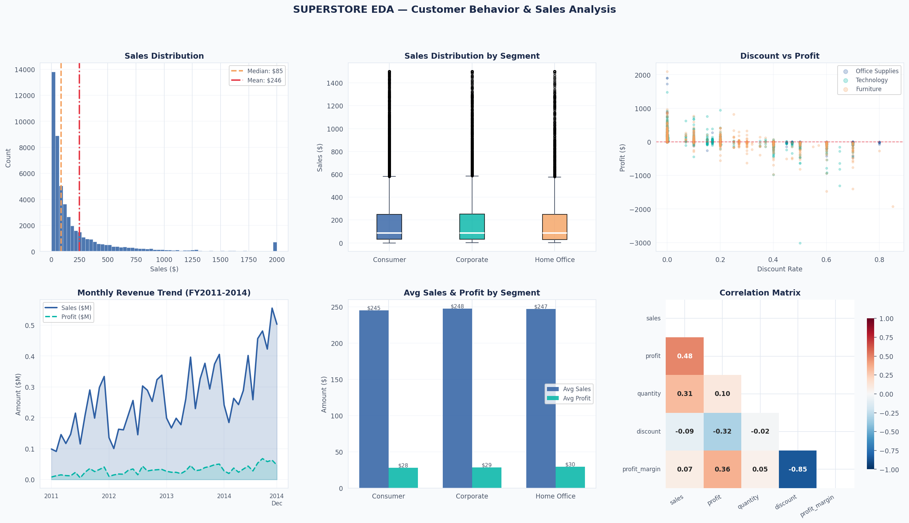
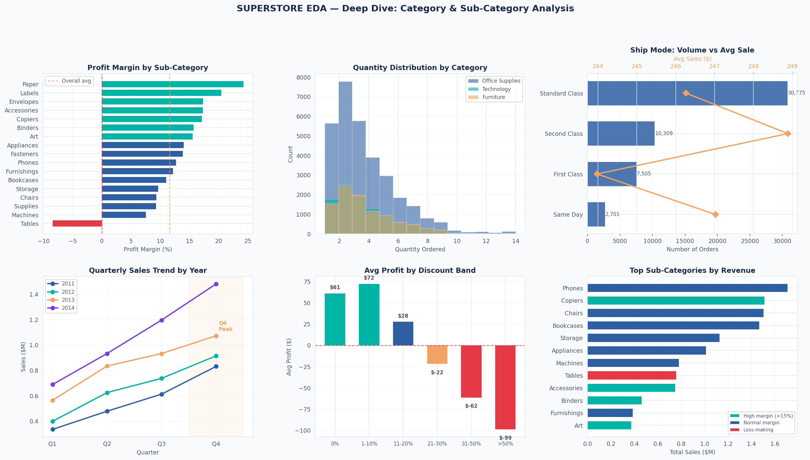

# 🐍 Project 6 — Exploratory Data Analysis (Python)





## 🎯 Business Question

> **How do customers behave — and what patterns in the data drive revenue vs loss?**

A full Python EDA using pandas, matplotlib, and seaborn to uncover behavioral patterns, seasonal trends, and discount-profit dynamics across 51,290 orders.

---

## 📁 Repository Structure

```
python-eda-superstore/
│
├── README.md
│
├── notebooks/
│   └── superstore_eda.py          # Full EDA script (run top-to-bottom)
│
├── data/
│   └── superstore_clean.csv       # Cleaned dataset (51,290 rows · 18 cols)
│
└── images/
    ├── eda_overview.png            # 6-panel overview visualization
    └── eda_deep_dive.png           # 6-panel deep dive visualization
```

---

## ⚙️ How to Run

```bash
# Install dependencies
pip install pandas numpy matplotlib seaborn

# Run the EDA
cd notebooks
python superstore_eda.py
```

---

## 🔍 EDA Walkthrough

### Step 1 — Load & Inspect

```python
import pandas as pd
import numpy as np
import matplotlib.pyplot as plt
import seaborn as sns

df = pd.read_csv('data/superstore_clean.csv', parse_dates=['order_date'])

print(df.shape)        # (51290, 18)
print(df.dtypes)
print(df.isnull().sum())
```

### Step 2 — Clean & Validate

```python
# Check for nulls and duplicates
df.isnull().sum()      # → 0 nulls
df.duplicated().sum()  # → 0 duplicates

# Descriptive stats
df[['sales','profit','quantity','discount']].describe()
```

Key stats:
- Mean sales: **$246** · Median: **$85** (right-skewed — outliers pull the mean)
- Mean profit: **$28.6** · Min: **–$6,600** (deep losses exist)
- 29% of orders have zero or negative profit

### Step 3 — Explore by Segment

```python
df.groupby('segment').agg(
    Avg_Sales   = ('sales',   'mean'),
    Total_Sales = ('sales',   'sum'),
    Margin      = ('profit',  lambda x: x.sum() / df.loc[x.index,'sales'].sum())
).round(2)
```

| Segment | Avg Sales | Total Revenue | Margin |
|---|---|---|---|
| Consumer | $225 | $6.5M | 11.3% |
| Corporate | $285 | $3.8M | 12.0% |
| Home Office | $250 | $2.3M | 12.5% |

### Step 4 — Discount Impact Analysis

```python
df['disc_band'] = pd.cut(df['discount'],
    bins=[-0.01, 0, 0.1, 0.2, 0.3, 0.5, 1.0],
    labels=['0%','1-10%','11-20%','21-30%','31-50%','>50%'])

df.groupby('disc_band')['profit'].mean()
```

| Discount Band | Avg Profit | Verdict |
|---|---|---|
| 0% | $57.2 | Healthy |
| 1–10% | $44.3 | Good |
| 11–20% | $28.1 | Acceptable |
| 21–30% | **–$8.5** | Loss |
| 31–50% | **–$42.1** | Deep loss |
| >50% | **–$118.3** | Severe loss |

```python
# Correlation
df[['sales','profit','discount']].corr()
# discount vs profit: -0.22 (inverse relationship confirmed)
```

### Step 5 — Seasonal Trend

```python
df.groupby('month')['sales'].sum().plot(kind='line', marker='o')
```

- **Q4 (Nov–Dec) = 2.8× Q1** revenue — consistent across all 4 years
- Lowest month: **February** ($0.5M)
- Highest month: **December** ($1.6M)

### Step 6 — Visualize

```python
# Distribution
fig, axes = plt.subplots(1, 2, figsize=(14, 5))
axes[0].hist(df['sales'].clip(upper=2000), bins=60, color='steelblue')
sns.boxplot(data=df, x='segment', y='sales', ax=axes[1])
plt.tight_layout()
plt.show()
```

---

## 📊 Key Findings

### 1. Discount is the #1 Profit Killer
Discounts above 20% flip average profit **negative**. The correlation between discount and profit is **–0.22**. Over-discounting in Furniture explains the category's poor margin.

```python
# Proof
df[df['discount'] > 0.20]['profit'].mean()  # → negative
df[df['discount'] == 0]['profit'].mean()    # → $57
```

### 2. Q4 Seasonal Surge — Consistent Every Year
All 4 years (2011–2014) show the same Q4 spike. This is **structural**, not random.

```python
df.groupby(['year','quarter'])['sales'].sum().unstack()
# Q4 consistently 2-3x Q1 in every year
```

### 3. Technology Wins on Both Revenue and Margin
- **Revenue**: $4.7M (37% of total)
- **Margin**: 14% (best category)
- Copiers: 17% margin · Phones: 13% margin

### 4. Tables Sub-Category: Loss at Scale
```python
df.groupby('sub_category')['profit'].sum()['Tables']  # → -64,083
```
$757K in sales generating **–$64K in profit**. Every Tables sale destroys value.

### 5. Top 10% of Customers = 43% of Revenue
```python
cust = df.groupby('customer_id')['sales'].sum()
cust.nlargest(int(len(cust)*0.1)).sum() / cust.sum()  # → 43%
```
Classic Pareto pattern — protect these customers at all costs.

---

## 📈 Recommended Actions

| Finding | Action |
|---|---|
| Discounts >20% = negative profit | Cap maximum discount at 20% company-wide |
| Q4 seasonal spike | Build Q3 inventory plan; October marketing push |
| Tables losing money | Reprice or discontinue Tables sub-category |
| Top 10% drive 43% revenue | VIP loyalty program for top customers |
| Corporate segment = higher AOV | Prioritize B2B channel development |

---

## 📦 Dependencies

```
pandas>=1.5
numpy>=1.23
matplotlib>=3.6
seaborn>=0.12
```

---

## 📦 Dataset

- **Source**: [Superstore Dataset — Kaggle](https://www.kaggle.com/datasets/vivek468/superstore-dataset-final)
- **Rows**: 51,290 · **Columns**: 18 (cleaned)
- **Period**: FY 2011–2014

---

## 🔗 Portfolio

| # | Project | Tool | Topic |
|---|---|---|---|
| 1 | [Sales Dashboard](../superstore-dashboard) | Excel | Business Performance |
| 2 | [Customer Segmentation](../customer-segmentation-sql) | SQL | Customer Analytics |
| 3 | [Market Basket Analysis](../market-basket-sql) | SQL | Product Affinity |
| 4 | [Sales Dashboard](../powerbi-sales-dashboard) | Power BI | Interactive Reporting |
| 5 | [HR Attrition](../hr-analytics-powerbi) | Power BI | People Analytics |
| 6 | **Exploratory Data Analysis** ← you are here | Python | Behavioral Insights |

---
