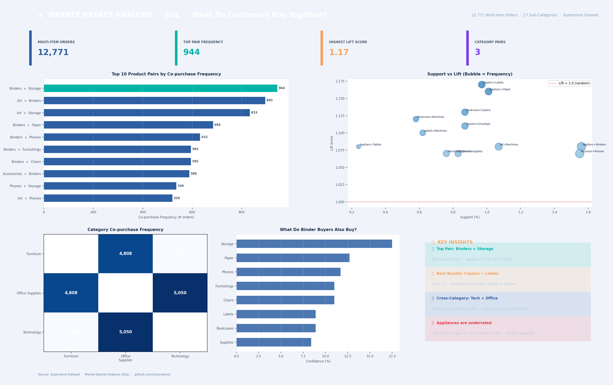

# 🛒 Project 3 — Market Basket Analysis (SQL)



## 🎯 Business Question

> **Which products are frequently bought together — and how do we use that to drive cross-sell and bundle revenue?**

This project applies Market Basket Analysis using SQL self-joins to identify product affinity patterns across 25,035 orders, ranked by Frequency, Support, Confidence, and Lift.

---

## 📁 Repository Structure

```
market-basket-sql/
│
├── README.md
├── dashboard.png
│
├── sql/
│   ├── 01_setup.sql                  # Data validation & item frequency
│   ├── 02_self_join_pairs.sql        # Core self-join to find all pairs
│   ├── 03_support_confidence.sql     # Support & Confidence metrics (CTE)
│   ├── 04_lift_analysis.sql          # Lift score — find true affinity
│   └── 05_category_pairs.sql        # Category-level analysis + bundle recs
│
├── data/
│   ├── product_pairs_frequency.csv   # All pairs sorted by frequency
│   └── product_pairs_lift.csv        # All pairs sorted by lift score
│
└── images/
    └── dashboard_preview.png
```

---

## ⚙️ Methodology

### Core Technique: Self-Join

```sql
SELECT 
    a.sub_category  AS product_1,
    b.sub_category  AS product_2,
    COUNT(DISTINCT a.order_id) AS frequency
FROM orders a
JOIN orders b
    ON  a.order_id     = b.order_id       -- same order
    AND a.sub_category < b.sub_category   -- avoid (A,B) + (B,A) duplicates
GROUP BY product_1, product_2
ORDER BY frequency DESC;
```

### Three Metrics Explained

| Metric | Formula | What it means |
|---|---|---|
| **Support** | pair_freq / total_orders | How often this pair appears overall |
| **Confidence** | pair_freq / freq_A | Given A was bought, how likely is B? |
| **Lift** | Support(A,B) / (Support(A) × Support(B)) | Is this association stronger than random? |

> **Lift > 1.0** = genuine product affinity (the pair buys together more than chance would predict)

### Full Lift Query (CTE Pattern)

```sql
WITH total AS (SELECT COUNT(DISTINCT order_id) AS n FROM orders),
item_support AS (
    SELECT sub_category,
           COUNT(DISTINCT order_id) AS freq,
           COUNT(DISTINCT order_id) * 1.0 / (SELECT n FROM total) AS support
    FROM orders GROUP BY sub_category
),
pairs AS (
    SELECT a.sub_category AS product_1, b.sub_category AS product_2,
           COUNT(DISTINCT a.order_id) AS pair_freq
    FROM orders a JOIN orders b
        ON a.order_id = b.order_id AND a.sub_category < b.sub_category
    GROUP BY product_1, product_2
)
SELECT p.product_1, p.product_2, p.pair_freq,
    ROUND(p.pair_freq * 100.0 / t.n, 2)                              AS support_pct,
    ROUND(p.pair_freq * 100.0 / s1.freq, 1)                          AS confidence_pct,
    ROUND((p.pair_freq * 1.0 / t.n) / (s1.support * s2.support), 2) AS lift
FROM pairs p
JOIN item_support s1 ON s1.sub_category = p.product_1
JOIN item_support s2 ON s2.sub_category = p.product_2
CROSS JOIN total t
ORDER BY lift DESC
LIMIT 20;
```

---

## 📊 Key Results

### Top Pairs by Frequency

| Product 1 | Product 2 | Frequency | Support | Confidence |
|---|---|---|---|---|
| Binders | Storage | 944 | 3.77% | 17.5% |
| Art | Binders | 895 | 3.57% | 20.5% |
| Art | Storage | 833 | 3.33% | 19.1% |
| Binders | Paper | 684 | 2.73% | 12.7% |
| Accessories | Binders | 588 | 2.35% | 20.4% |

### Top Pairs by Lift (True Affinity)

| Product 1 | Product 2 | Frequency | Lift | Insight |
|---|---|---|---|---|
| Copiers | Labels | 243 | **1.17** | Best bundle candidate |
| Appliances | Paper | 253 | **1.16** | Underrated cross-sell |
| Bookcases | Copiers | 218 | **1.13** | Office setup pair |
| Copiers | Envelopes | 218 | **1.11** | Print supply affinity |
| Accessories | Phones | 387 | **1.07** | Tech upsell |

### Category Co-purchase Matrix

| | Furniture | Office Supplies | Technology |
|---|---|---|---|
| **Furniture** | — | 4,808 | 2,388 |
| **Office Supplies** | 4,808 | — | **5,050** |
| **Technology** | 2,388 | **5,050** | — |

---

## 💡 Key Insights

### 🏆 Binders + Storage = #1 Pair by Volume
944 orders (3.8% of all orders) include both. However, lift is 0.97 — meaning this is largely driven by both being popular items. **Volume ≠ true affinity.**

### 📦 Copiers + Labels = Best Bundle Candidate
Lift 1.17 with 243 co-purchases. Buyers of Copiers are 17% more likely to also buy Labels than random chance predicts — a clear bundle or "frequently bought together" recommendation opportunity.

### 🔗 Tech + Office Supplies = Biggest Cross-Category Opportunity
5,050 orders combine both categories. A cross-category promotional strategy (e.g., "Add Office Supplies to your Technology order") could be high-impact.

### 💡 Appliances Are an Underrated Bundle
Appliances show lift >1.1 with Paper, Binders, and Copiers. These are rarely promoted together yet show genuine co-purchase affinity.

---

## 📈 Recommended Actions

| Finding | Action | Revenue Potential |
|---|---|---|
| Copiers + Labels (lift 1.17) | Create product bundle with 5% discount | High — printer supply repeat purchases |
| Tech + Office Supplies (5,050 orders) | Cross-category "complete your setup" promo | Very High — largest co-purchase volume |
| Appliances + Paper/Binders | Add "Frequently Bought Together" widget | Medium — untapped affinity |
| Accessories + Phones (lift 1.07) | Phone purchase → Accessories upsell pop-up | High — easy checkout upsell |

---

## 🛠️ How to Run

```bash
# SQLite
sqlite3 superstore.db < sql/01_setup.sql
sqlite3 superstore.db < sql/02_self_join_pairs.sql
sqlite3 superstore.db < sql/03_support_confidence.sql
sqlite3 superstore.db < sql/04_lift_analysis.sql
sqlite3 superstore.db < sql/05_category_pairs.sql
```

Compatible with PostgreSQL and MySQL with minor syntax adjustments.

---

## 📦 Dataset

- **Source**: [Superstore Dataset — Kaggle](https://www.kaggle.com/datasets/vivek468/superstore-dataset-final)
- **Orders analyzed**: 25,035 · **Multi-item orders**: 12,771 (51%)
- **Sub-categories**: 17 · **Unique pairs**: 136

---

## 🔗 Portfolio

| # | Project | Tool | Topic |
|---|---|---|---|
| 1 | [Sales Dashboard](../superstore-dashboard) | Excel | Business Performance |
| 2 | [Customer Segmentation](../customer-segmentation-sql) | SQL | Customer Analytics |
| 3 | **Market Basket Analysis** ← you are here | SQL | Product Affinity |

---
